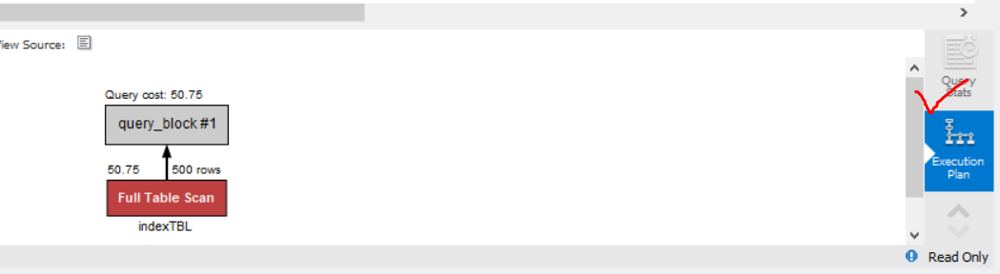

## 3.2.1 데이터베이스 생성

<br>

> shopdb 데이터베이스 생성 
```sql
# 스키마 생성 
create schema shopdb; 

# shopdb 사용 
use shopdb;
```

<br>

## 3.2.2 테이블 생성 

<br>

> 회원 테이블 생성

| 열이름| 영문이름 |테이터 형식| 길이 | NULL허용|
|---|---|---|---|---|
아이디(기본키) | memberId | CHAR | 8글자(영문) |  x 
회원이름 | membername | CHAR | 5글자(한글) | X
주소 |   memberAddress | CHAR | 20글자(한글)  | X

<br>

```SQL
CREATE TABLE MEMBERTBL (
	memberId CHAR(8) NOT NULL, 
    memberName CHAR(5) NOT NULL,
    memberAddress CHAR(20) NOT NULL, 
    PRIMARY KEY(memberId) 
);

# 생성되었는 확인
SELECT * FROM MEMBERTBL;
```
- PRIMARY KEY : 기본키 
- NOT NULL : NULL 허용하지 않음

<br>

> 제품테이블 생성

| 열이름| 영문이름 |테이터 형식| 길이 | NULL허용|
|---|---|---|---|---|
| 제품이름 | productName | CHAR | 4 | X
|가격 | cost | INT | 정수 |X
|제조일자| makeDate| DATE| 날짜형|O
|제조회사| company |CHAR | 5글자(한글) |O
|남은수량| amount| INT| 정수| X

<br>

```sql
CREATE TABLE PRODUCTTBL(
	productName CHAR(4) NOT NULL,
    cost INT NOT NULL,
    makeDate DATE, 
    company CHAR(5), 
    amount INT NOT NULL,
    PRIMARY KEY (productName)
); 

# 생성되었는지 확인 
SELECT * FROM productTbl;
```

<br>

## 3.2.3 데이터입력

<br>

<h3>회원 데이터 ( 아이디 / 이름 / 주소  )</h3><br>

> Dang / 당탕이 / 경기 부천시 중동 <br>
> Jee / 지운이 / 서울 은평구 중산동 <br>
> Han / 한주연 / 인천 남구 주안동 <br>
> Sang / 상길이 / 경기 성남시 분당구 <br>
```sql
# 회원데이터
INSERT INTO membertbl VALUES (
'Dang', '당탕이', '경기 부천시 중동');
INSERT INTO membertbl VALUES (
'Jee', '지운이', '서울 은평구 중산동');
INSERT INTO membertbl VALUES ('Han', '한주연', '인천 남구 주안동');
INSERT INTO membertbl VALUES ('Sang', '상길이', '경기 성남시 분당구');

# 다음과 같이 간단히 할 수 있다
INSERT INTO membertbl VALUES 
	('Dang', '당탕이', '경기 부천시 중동'), 
	('Jee', '지운이', '서울 은평구 중산동'),
	('Han', '한주연', '인천 남구 주안동'),
	('Sang', '상길이', '경기 성남시 분당구');
```

<br>

<h3>제품데이터(제품명 / 비용 / 날짜 / 제조사 / 수량)</h3><br>

> 냉장고 / 5 / 2023-02-01 / 대우 / 22 <br>
> 세탁기 / 20 / 2022-09-01 / LG / 3 <br>
> 컴퓨터 / 10 / 2021-01-01 / 삼성 / 17 <br>
```sql
# 데이터 삽입
insert into producttbl values
('냉장고', 5, '2023-02-01', '대우', 22),
('세탁기', 20, '2022-09-01', 'LG', 3),
('컴퓨터', 10, '2021-01-01', '삼성', 17); 

# 데이터 확인
SELECT * FROM producttbl;
```

<br>

## 3.2.4 데이터의 활용
- 모든 회원 정보 조회
- 이름과 주소만 조회 
- '지운이' 정보만 조회
```sql
# 회원의 모든 정보 조회
select * from memberTbl; 

# 이름과 주소만 조회
select memberName, memberAddress from memberTbl;

# 지운이 정보만 조회
select * from memberTbl where memberName = '지운이';
```

<br>

<h3> 새로운 테이블 생성</h3><br>

- 간단한 새로운 테이블을 생성한다. 
- 백틱을 사용하면 테이블명에 공백을 허용한다. 
```sql
create table `my table`(
	id int
);
select * from `my table`;
```

<h3>테이블 삭제</h3><br>
 
```sql
drop table `my table`;
```

<br>

## 3.3.1 인덱스
- 인덱스는 테이블의 열단위에 생성된다. (복합인덱스는 별론으로 한다.)
- 열을 기본키로 설정하면 자동으로 인덱스가 생성된다. 
- 인덱스 사용 여부를 확인하기 위해 적정량이 있는 테이블을 생성한다. 
```sql
# 테이블 생성 
create table indexTBL(
	first_name varchar(14), 
    last_name varchar(16),
    hired_date date
);

# 500건의 데이터 삽입
insert into indexTBL 
select first_name, last_name, hire_date
from employees.employees LIMIT 500; 
```
<br>

- 인덱스가 없는 상황에서 테이블 조회 
```sql
select * from indexTBL where first_name = 'Mary';
```
- 실행계획(Execution Plan)을 확인

- Full Table Scan : 인덱스를 사용하지 않고 테이블 전체 검색

- first_name 열에 인덱스 생성
```sql
create index idx_indexTBL_fristname on indexTBL(first_name);
```
- 실행계획(Execution Plan)을 확인

- Non-Unique Key Lookup : 인덱스를 사용했다는 의미이다.

<br>

## 3.3.2 뷰
- 가상의 테이블이다. 
- 사용자 입장에서 테이블과 동일하게 보이지만, 실제 행 데이터를 가지지 않는다. 
- 실제 테이블에 링크된 개념이라고 생각하면된다.
- memberTbl 테이블로부터 회원이름과 주소만 존재하는 뷰를 생성하자. 
```sql
create view uv_memberTbl as select memberName, memberAddress from memberTbl'
```
- view 실체는 selct문이다. 
- uv_memberTbl 뷰에 접근하면 뷰생성시에 입력한 select 문이 동작한다. 
- 뷰의 조회방법은 테이블과 동일하다. 
```sql
select * from uv_memberTbl;
```

<br>

## 3.3.3 스토어드 프로시저
- MySQL에서 지원해주는 프로그래밍 기능
- 회원테이블 '당탕이'의 정보와 제품 테이블의 '냉장고' 정보를 동시에 조회한다고 가정한다.
```sql
# 프로시저 생성
DELIMITER //
CREATE PROCEDURE myProc()
BEGIN
	select * from memberTbl where memberName = '당탕이';
	select * from producttbl where productName= '냉장고';
END //
DELIMITER;

# 프로시저 호출
CALL myproc();

# 프로시저 삭제 
drop procedure myProc; 
```

<br>

## 3.3.4 트리거
- 테이블에 부착되어 insert, update 또는 delete 작업이 발생되면 실행되는 코드이다.
- 지워진 데이터를 보관할 테이블을 만든다.
```sql
create table deletedMemberTbl(
	memberID char(8),
    memberName char(5),
    memberAddress char(20),
    deletedDate date
);
```
- 회원테이블에 delete 작업이 일어나면 백업 테이블에 지워진 데이터가 기록되는 트리거를 생성한다. 
```sql
DELIMITER //
create trigger trg_deletedMemberTbl 
	after delete 
    on memberTbl
    for each row
begin
	insert into deletedMemberTbl 
    values (old.memberId, old.memberName, old.memberAddress, curdate()); 
end;
DELIMITER; 
```

- 새로운 회원을 등록하고 삭제하자. 
```sql
# 새로운 회원 등록
insert into memberTbl values('Figure','연아','경기도 군포시 당정동'); 

# 데이터 변경
update membertbl set memberAddress = '서울 강남구 역삼동'
where memberName = '연아'; 

# 데이터 삭제 
delete from memberTbl where memberName = '연아';
```

- 백업 테이블을 확인한다. 
```sql
select * from deletedMemberTbl; 
```

<br>

# 데이터베이스 백업 및 관리 

## 3.4 데이터의 백업과 복원 
- shopDb를 백업한 후 데이터를 실수로 삭제했다고 가정하고 원상태로 복원해보자.
- c:\Temp\db백업 폴더를 만들고 이 폴더를 다른 디스크장치라고 가정한다.


- 실수로 삭제했다고 가정하고 productTbl의 모든 데이터를 삭제한다. 
```sql
delete from productTbl; 
```
- 사용중인 DB를 복원하면 문제가 생길수 있다. 다른 데이터베이스 변경한다.
```sql
use sys; 
```


- 데이터가 잘 복원되었는지 테이블을 조회해보자


